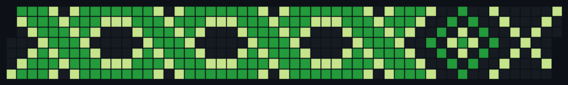

# GitHub Contributions Art Planner

This project helps you create visually appealing GitHub contribution patterns by automating your commits and synchronizing reminders with Google Calendar. Follow the steps below to set up and customize your grid art.

During setting Google Calendar API, I followed <a href="https://www.youtube.com/watch?v=B2E82UPUnOY" target="_blank">
  NeuralNine tutorial</a>, and then adjusted it to my code.


<div align="center">
  
</div>

<div align="center">
  
</div>


---

## **Table of Contents**
1. [Installation](#installation)
2. [Configuration](#configuration)
3. [Usage](#usage)
4. [Google Calendar Integration](#google-calendar-integration)
5. [Contributions](#contributions)

---

## **Installation**

1. **Clone the repository:**
   ```bash
   git clone https://github.com/your-repo-name.git
   cd your-repo-name
   ```    

2. **Create and activate a virtual environment:**
   ```bash
   python3 -m venv .venv
   source .venv/bin/activate  # For Linux/Mac
   .venv\Scripts\activate     # For Windows
   ``` 


3. **Install dependencies:**
   ```bash
   pip install -r requirements.txt
   ``` 


## **Configuration**

**Select Your GitHub Theme and Art Style**

   Choose between a light or dark theme for your grid, choose an available art model or contribute another one.
   ```python
   theme = "light"  # Options: "dark", "light"
   ``` 
**Choose Art Colors**

   Customize the colors for your contribution levels, the palette used is the default GitHub palette:
   ```python
   green_max  = "#196127"
   green_more = "#239a3b"
   green_less = "#7bc96f"
   green_min  = "#c6e48b"
   ``` 

## **Usage**

**Generate the Grid Art**

   Call the function to create the desired grid pattern: 
   ```python
   create_grid(art_num1(colors, green_min, green_more), box_edge_color)
   ```
   In future, other arts may be available !!

**Create a Contribution Plan**

   Generate a contribution plan from the grid data:
   ```python
   contributions_df = generate_dataframe(colors, box_blank_color)
   ```

**Define Start Date**

   Set the start date for your contributions:
   ```python
   start_date = datetime(2024, 12, 29, 10, 0)  # 10:00 AM
   ```
   This date is selected for symitrical reasons, think about it


## **Google Calendar Integration**

**Set Up Google Calendar API**

1. **Enable the Google Calendar API:**
    - Go to the Google Cloud Console.
    - Create a new project and enable the Google Calendar API.

2. **Download Credentials:**
    - Download the `credentials.json` file and place it in the project directory.

3. **Authenticate and Generate token.json:**
    ```python
    SCOPES = ["https://www.googleapis.com/auth/calendar"]
    ```
The script will automatically prompt for authorization and generate `token.json`.

**Create Calendar Events**

 Run the script to create reminders:
   ```python
   for day in contributions_list:
       service = build("calendar", "v3", credentials=creds)
       event = {
           "summary": "GitHub Contributions Reminder !!",
           "description": f"Today you should commit: {day['contributions']} contributions.\nGrab a PC and commit to make the art happen!",
           ...
        }
        event = service.events().insert(calendarId="primary", body=event).execute()
   ```

## **Contributions**

Pull requests and feature suggestions are welcome. Feel free to fork the repository and contribute!


---
Enjoy !!
